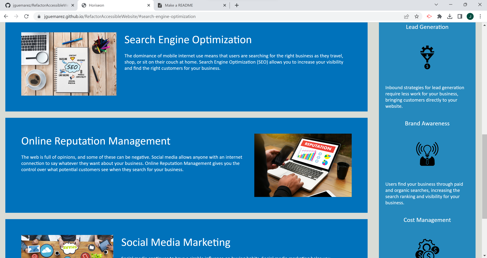

# Refactor Challenge Code

## Description

As a challenge, we decided to refactor the source code for the corporate webpage of Horiseon. The purpose was two-fold:

    1. By making extensive use of semantic HTML elements and captions, we wanted to make the page more accessible to people with disabilities
        that employ web assisstive technologies such as screen readers in order to navigate the web.

    2. By consolidating the CSS selectors and the corresponding properties and by naming said selectors in such a way that reflects HTML semantic structure,
        we wanted to make the stylesheet code easier to understand to web developers, making the job of mantaining/modifying it more amenable.

## Usage

The refactored code can be found at the project's public repository on GitHub by employing this URL: https://github.com/jguemarez/RefactorAccessibleWebsite .

You can access the finished static webpage, deployed at GitHub Pages, by using this URL: https://jguemarez.github.io/RefactorAccessibleWebsite.

The webpage must look something like that on most browsers:

Note: The images show the top and middle portions, respectively, of the webpage as rendered by the Google Chrome Version 114.0.5735.199 (Official Build) (64-bit) browser.

In order to gain direct access to any of the sections in the main content area of the page, just press the corresponding link in the navigation bar located on the rightmost portion of the header:

## Authoring

The original (source code) is available at https://github.com/coding-boot-camp/urban-octo-telegram and is of the authorship of Xandromus.

The refactored code is available at https://github.com/jguemarez/RefactorAccessibleWebsite and was authored by Jonathan Maldonado Guemarez.

## Contributing

The RefactorAccessibleWebsite repository is public, so that pull requests are welcome. Before enacting any change to the code (or to this README file), you must first
open an issue where the recommended modifications are made explicit.

## License
This is an open-source project using the following license:

[MIT](https://choosealicense.com/licenses/mit/)

For more information:

    1. go to the repository hosted at GitHub using this following URL: https://github.com/jguemarez/RefactorAccessibleWebsite
    
    2. Click on the link for the LICENSE document.